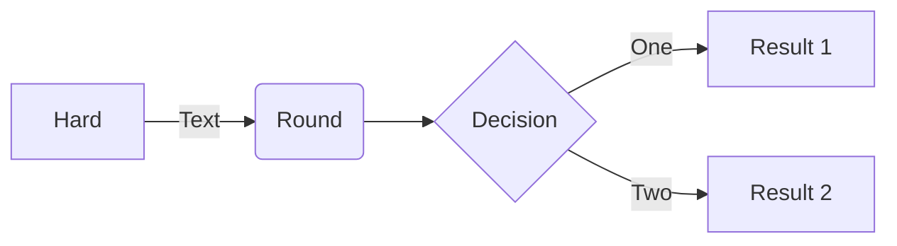
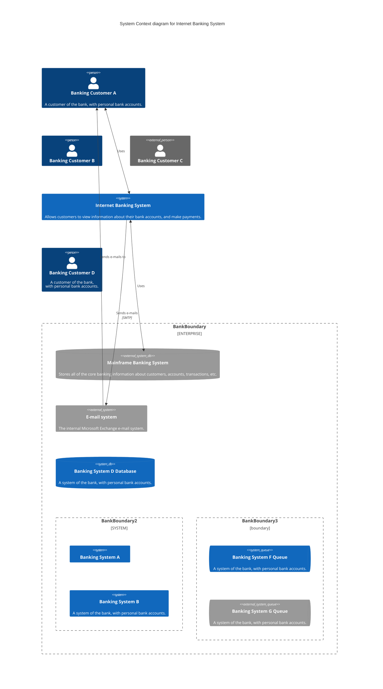

---
sys:
  pageId: "6eeff8fd-18ed-4317-860b-8f57bb3dd916"
  createdTime: "2024-04-16T17:21:00.000Z"
  lastEditedTime: "2024-04-17T04:40:00.000Z"
  propFilepath: "docs/Robot_Architecture.md"
title: "Robot_Architecture"
date: "2024-04-17T00:00:00Z"
description: ""
tags:
  - "Onboarding"
categories:
  - "test"
author: "Overridden author"
draft: false
section: "asdf"
toc: false
icon: "family_history"
---

